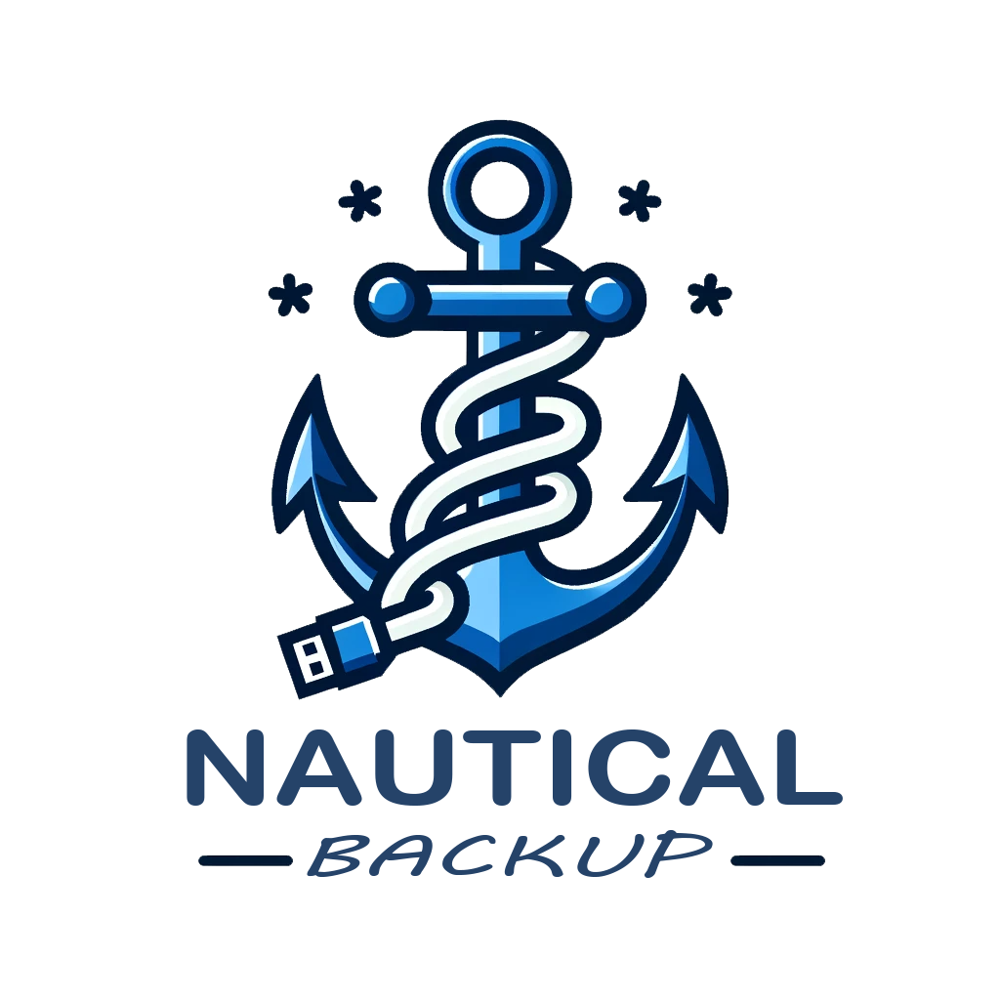

    
    
A simple container to backup your container volumes.

---

 

  

### Documentation
Full documentation is available at [https://minituff.github.io/nautical-backup](https://minituff.github.io/nautical-backup)