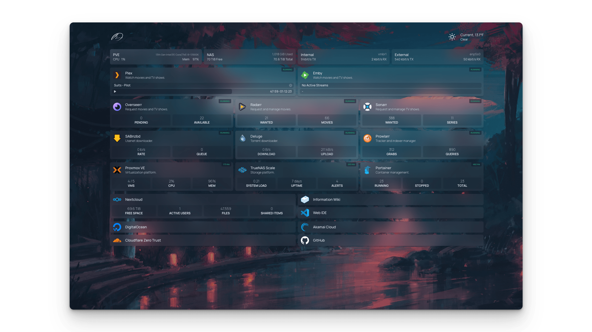

[Homepage](https://gethomepage.dev) is a modern, <em>fully static, fast</em>, secure <em>fully proxied</em>, highly customizable application dashboard with integrations for over 100 services and translations into multiple languages. Easily configured via YAML files or through docker label discovery.



## Add Nautical to Homepage

We are going to take advantage of Homepage's [Custom API Widget](https://gethomepage.dev/latest/widgets/services/customapi) to get the following result:


Our configuration will look something like this:

```yaml
- Nautical Backup:
    icon: https://raw.githubusercontent.com/Minituff/nautical-backup/main/docs/media/Logo-large.png
    description: Docker Volume Backups
    widget:
        type: customapi
        url: http://<nautical-ip>:8069/api/v1/nautical/dashboard
        username: admin
        password: password
        method: GET
        mappings:
        - field: number_of_containers
          label: Total Containers
        
        - field: completed
          label: Completed
        
        - field: skipped
          label: Skipped
        
        - field: errors
          label: errors
        
        - field: last_cron 
          label: Last Run
          format: relativeDate # (1)!

        - field: next_cron
          label: Next Run

```

1. Here, you can set an additional property called `format` to one of these options:
    * `relativeDate` example: 10 hours ago
    * `date` removes the exact time and shows the day only
    
    You can also add this to the `next_cron` field.


It is recommended that you don't enable **all** the fields. Just comment out the fields that you don't need.

??? abstract "Field Translation"
    ```json
    {
        "next_cron": {
        "1": [
            "Monday, April 22, 2024 at 05:00 AM",
            "04/22/24 05:00"
        ],
        "2": [
            "Tuesday, April 23, 2024 at 05:00 AM",
            "04/23/24 05:00"
        ],
        "3": [
            "Wednesday, April 24, 2024 at 05:00 AM",
            "04/24/24 05:00"
        ],
        "4": [
            "Thursday, April 25, 2024 at 05:00 AM",
            "04/25/24 05:00"
        ],
        "5": [
            "Friday, April 26, 2024 at 05:00 AM",
            "04/26/24 05:00"
        ],
        "cron": "0 5 * * *",
        "tz": "America/Los_Angeles"
        },
        "last_cron": "04/21/24 05:00",
        "number_of_containers": 33,
        "completed": 25,
        "skipped": 8,
        "errors": 0,
        "backup_running": 8
    }
    ```

